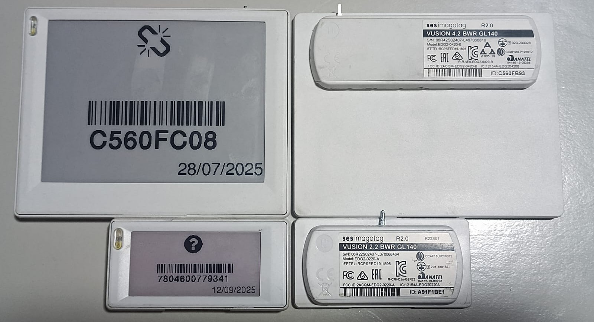
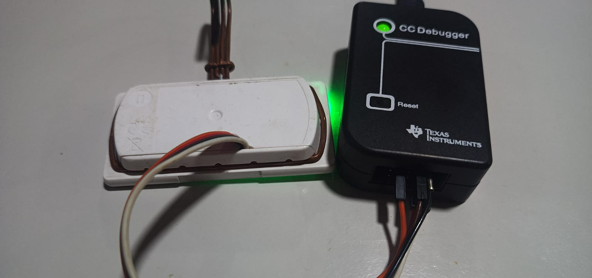

# Firmware para CC2510


Este es un proyecto para el control de estos tags Epaper de 2,2" o 4,2" (tambien hay algunos 2,6 que traen este MCU, pero no todos)
Es un script para el control del chip CC2510 de Texas instruments, MCU basado en el antiguo 8051 + transceptor de RF a 2,4GhZ

## ✨ Documentación
- [CC2510 - MCU + radio - 8051](../../raw/master/doc/cc2510.pdf) - Corazon del proyecto.
- [NT3H2111 - NFC](../../raw/master/doc/NT3H2111_2211.pdf) - Chip programable por I2C.
- [Pervasives Display - 2.13"/4,17" EPD display](../../raw/master/doc/Pervasives.pdf) - La pagina de pervasives al parecer descontinuó las screens usadas (Spectra Red) que eran las de 3 colores "SE2xxxJS0E1" (donde "xxx" es el tamaño de la screen) pero incluí 2 librerías en .zip para el manejo de estas, una mas pesada y llena de funciones a mi parecer inutiles, pero facil de usar e intuitiva, y otra con lo justo y mucho mas liviana.
- [TPS61071 - boost converter](../../raw/master/doc/tps61071.pdf) - Usado para dar energía a los leds.
- [W25X10CL - Winbond 1Mbits NOR SPI flash](../../raw/master/doc/w25x10cl.pdf) - Memoria flash externa por SPI

## 📦 Requisitos
Lista de herramientas necesarias:
- Lenguaje o entorno (C, SDCC, Make)
  * SDCC utilizado para compilar proyecto en .hex listo para flashear, en este proyecto hay un "Makefile" que automatiza la compilacion, deberás instalar "Make"
- Hardware asociado
    * Ahora, para flashear, necesitaras un CC-Debugger, hay metodos para utilizar un arduino nano o un esp32 como Debugger, pero personalmente recomiendo ahorrarse el dolor de cabeza que significa esto e ir por la apuesta segura, en Aliexpress se pueden encontrar a unos 10 Dolares, creeme que tu salud mental lo agradecerá.
     imagen referencial.
- Software:
    * SmartRF Studio (Recomendado)
        * Software entregado por texas instruments de manera gratuita para probar y configurar comunicación por RF sin necesidad de programar el chip, sirve para exportar todas las variables necesarias para la configuracion del modo RF del CC2510 o cualquier chip de la familia CCxxxx
    * SmartRF Flash Programmer (Necesario)
        * No descargar V2, tambien es entregado de manera gratuita, pero será necesaria la creacion de una cuenta en la pagina de Texas Instruments. Este software es para flashear el .hex en el chip.
    * SmartRF Packet Sniffer (Opcional)

## 🚀 Compilación
Teniendo todo lo necesario, para compilar simplemente ejecutamos los siguientes comandos en Shell:
```shell
PS C:\Users\Usuario\Desktop\firmware> make
```
Donde deberás ver que termine en algo similar a:
```shell
  packihx firmware.ihx > firmware.hex
  packihx: read 378 lines, wrote 721: OK.
PS C:\Users\Usuario\Desktop\firmware>
```
Luego para borrar archivos innecesarios que se crean mientras compila, ejecuta:
```shell
PS C:\Users\Usuario\Desktop\firmware> make clean
  Limpiando archivos generados...
  Limpieza completa.
PS C:\Users\Usuario\Desktop\firmware>
```
Y así tendras un nuevo "firmware.hex" en el directorio principal.
El "Makefile" está diseñado para windows, pero tiene comentada la parte del codigo que lo hace compatible en linux (no se si funcione bien) deberás comentar o borrar la parte para win y descomentar la parte para linux

## ⚡ Flasheo
Para flashear, deberás conectar el Debugger al chip soldando 5 cables, 2 de alimentacion y los otros 3 de datos (Reloj, datos y reset) (mirar imagenes, detallan de donde sacar las lineas necesarias para esto)
 imagen referencial.

## 🔌 Pinout del CC2510

### Port 0
- P0:0 - EPD power enable (active low via a P channel fet)
- P0:1 - EPD CS (SPI interface chip select)
- P0:2 - debug port
- P0:3 - EPD SDI (SPI interface serial data in)
- P0:4 - SDA to NFC chip
- P0:5 - EPD CLK (SPI interface clock)
- P0:6 - SCL to NFC chip
- P0:7 - *not connected*

### Port 1
- P1:0 - NFC VCC (seems to power NFC chip and SPI flash)
- P1:1 - NFC FD (field detection)
- P1:2 - EPD DC (data/command select for display)
- P1:3 - EPD BUSY (detect if display busy)
- P1:4 - SPI flash CS 
- P1:5 - SPI flash CLK  and Red LED (RGB)
- P1:6 - SPI flahs MOSI and Blue LED (RGB)
- P1:7 - SPI flahs MISO and Green LED (RGB)

### Port 2
- P2:0 - EPD Reset (display reset)
- P2:1 - debug data and white LED
- P2:2 - debug clock and LED boost chip enable (TPS61071)

## ⚠️ Ayuda
Actualmente estoy en este proyecto unicamente como hobbie, la electronica es algo que me apaciona y me gusta hacer, lamentablemente, no soy experto y jamás he hecho ningun curso de programacion o nada parecido, lo que se es investigando, leyendo y preguntandole a chatGPT (el cual, en este proyeto, poco es lo que ayuda, sinceramente, pero si he logrado entender muchas partes de este codigo gracias a el).

Por ahora, no he logrado echar a andar lo que es la comunicacion RF ni tampoco el sueño profundo para un bajo consumo de energía, si alguien por ahí logra avanzar en este proyecto, agradecería mil que se comunique conmigo y me preste ayuda para lograr aprender y avanzar.
Edit: Logré hacer que funcione el RF, pero no logré hacer que funcione el sleep profundo, por lo que el consumo es alto.
implementé un bloque rf que escucha la palabra "LED x" donde x puede ser R, G o B, para controlar los colores del led y una imagen en la pantalla, la cual es la que se encuentra en el archivo "image.h".

### ⚠️ Importante:
Este proyecto está completamente basado en otro repositorio que encontré:
[Echar un vistazo acá](https://github.com/andrei-tatar/imagotag-hack?tab=readme-ov-file)

### 🔗 Más enlaces utiles
- [Como controlar únicamente el Screen](https://blog.jirkabalhar.cz/2023/12/hacking-sesimagotag-e-ink-price-tag)