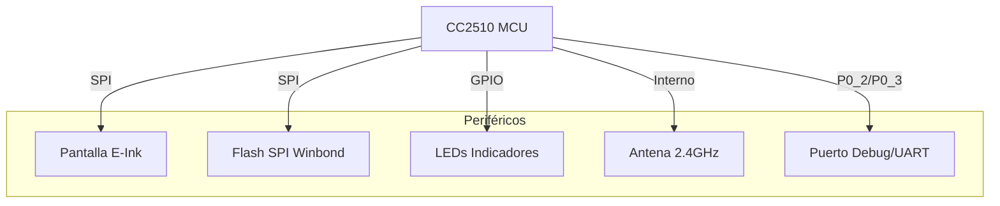

# 01. Resumen General del Proyecto

## Visión General
Este proyecto consiste en el desarrollo de un firmware personalizado para etiquetas electrónicas de estantería (ESL - Electronic Shelf Labels) basadas en el microcontrolador **Texas Instruments CC2510**. El objetivo principal es reutilizar este hardware existente para controlar pantallas de tinta electrónica (E-Paper / EPD) y establecer comunicación inalámbrica.

El sistema permite controlar la pantalla, gestionar periféricos básicos como LEDs, y comunicarse mediante radiofrecuencia (RF) y un puerto serial emulado (UART) utilizando el protocolo COBS.

## Hardware Soportado
El firmware está diseñado específicamente para el hardware encontrado en ciertas etiquetas ESL comerciales (como las de la marca SES-imagotag) que han sido "hackeadas" o reutilizadas.

### Componentes Principales:
1.  **MCU: Texas Instruments CC2510**
    *   Núcleo 8051 mejorado.
    *   Transceptor de RF integrado a 2.4 GHz.
    *   32 KB de Flash programable, 4 KB de RAM.
    *   Interfaz I2S, DMA, Timers, ADC.

2.  **Pantalla: Pervasive Displays (E-Paper)**
    *   Tecnología E-Ink Spectra (Blanco, Negro, Rojo).
    *   Tamaños comunes: 2.2", 2.6", 4.2".
    *   Controlador integrado (COG - Chip On Glass) con interfaz SPI.

3.  **Memoria Externa: Winbond W25X10CL**
    *   1 Mbit (128 KB) Serial Flash.
    *   Interfaz SPI.
    *   Utilizada para almacenar imágenes o datos que no caben en la flash del MCU.

4.  **Gestión de Energía: TPS61071**
    *   Convertidor Boost ajustable.
    *   Utilizado para elevar el voltaje necesario para ciertos componentes (como los LEDs o la pantalla).

5.  **NFC: NXP NT3H2111 / NT3H2211 (Opcional)**
    *   Etiqueta NFC conectada por I2C.
    *   Permite configuración o despertar el dispositivo mediante un smartphone (aún no implementado completamente en firmware).

## Funcionalidades Actuales
*   **Control de Pantalla EPD:** Inicialización, limpieza y actualización de imágenes en 3 colores (B/N/R).
*   **Indicadores LED:** Control de LEDs RGB y Blanco para estado y depuración.
*   **Comunicación Serial (UART/COBS):** Implementación de UART por software/hardware (dependiendo de la configuración de pines) y protocolo COBS para transmisión de paquetes robusta.
*   **Radiofrecuencia (RF):** Configuración básica del radio para envío y recepción de paquetes a 2.4 GHz (en desarrollo).
*   **Gestión de Reloj:** Configuración del oscilador de cristal externo para precisión en RF y UART.

## Diagrama Conceptual del Sistema

## Estado del Desarrollo
El proyecto se encuentra en una fase funcional pero experimental. Los drivers básicos de hardware (HAL) y pantalla están operativos. La comunicación RF y el acceso a la Flash externa están implementados pero requieren depuración adicional para garantizar estabilidad completa. El modo de bajo consumo (Deep Sleep) está en investigación para optimizar la duración de la batería.
